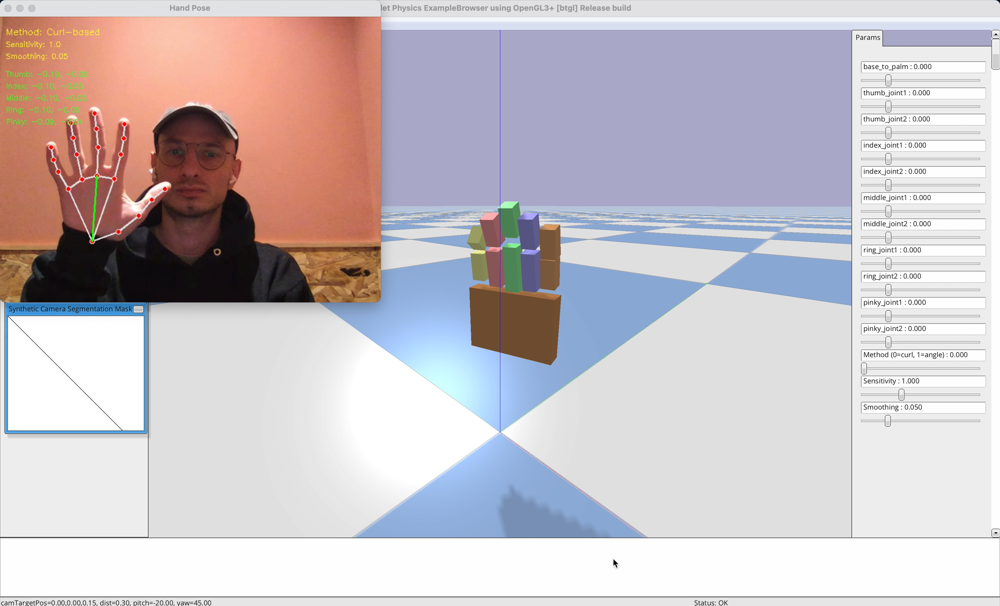

# 🦾 A simple Pybullet robot hand model 

## WIP



Reflects your hand movement from hand pose estimation via `Mediapipe`

`Camera stream -> Mediapipe -> Finger angles -> Move robotic arm in Pybullet simulation`


## Install

```
conda create --name mp_env python=3.10 numpy
conda activate mp_env
pip install -r requirements.txt
```

## Run

`python main.py`

## TODO

- [x] Basic implementation
- [ ] Add finger phalanges
- [ ] Advanced finger movement
- [ ] Refactor
- [ ] Advanced Hand model


