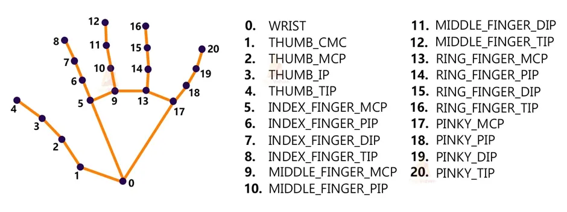

# 🦾 A simple pybullet robot hand model reflects your hand movement from hand pose estimation via medipipe

`Camera stream -> Mediapipe -> Finger angles -> Move robotic arm in simulation`

## Install

`conda create --name mp_env python=3.10 numpy`

`conda activate mp_env`

`pip install -r requirements.txt`

## Run

`python main.py`

## TODO

